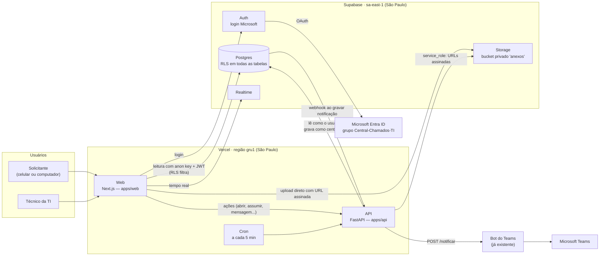

# Arquitetura

## Quem faz o quê

| Peça | Responsabilidade |
|---|---|
| **Web** (`apps/web`) | Telas do portal do solicitante e da área técnica (kanban). **Só acessa dados por `lib/dados/`** ([ADR 0006](adr/0006-front-com-dados-simulados.md)): versão `simulada` (hoje) ou `real` (Supabase + API). |
| **API** (`apps/api`) | Toda **ação de negócio**: abrir chamado, transições de status, mensagens, anexos, sincronizar papel. Valida a máquina de estados ([status.md](status.md)) e grava histórico + notificação na mesma transação. |
| **Postgres** | Fonte da verdade. **RLS em todas as tabelas**: o usuário só lê o que pode, e não grava nada direto ([banco.md](banco.md)). Travas que valem até se alguém contornar a API (chamado encerrado é só leitura, histórico não muda, chamado não é apagado). |
| **Auth** | Login com a conta Microsoft (provider Azure). O papel `ti` vem do grupo **Central-Chamados-TI** do Entra ([ADR 0004](adr/0004-papeis-entra-id.md)). |
| **Realtime** | Chat, quadro e status atualizam sem recarregar. Respeita o RLS: nota interna não chega ao solicitante. |
| **Storage** | Anexos em bucket privado; URL assinada de upload e de download. |
| **Bot do Teams** | Envia os avisos (Adaptive Cards) e responde automaticamente quem escreve para ele ([etapa 1E](fases/1E-teams.md)). |

## Quem lê e quem grava ([ADR 0002](adr/0002-modelo-leitura-escrita.md))

| Papel no banco | Quem usa | Pode |
|---|---|---|
| `anon` | ninguém | nada |
| `authenticated` | navegador (anon key + JWT) e API ao **ler** | só ler, filtrado por RLS; editar o próprio departamento/telefone |
| `central_api` | API ao **gravar** | inserir/atualizar; nunca apagar chamados, mensagens, anexos ou histórico |
| `service_role` | API, só para Storage e jobs | tudo — **nunca** vai para o navegador |

Uma ação na API, numa única transação:
1. `set local role authenticated` + claims do JWT → lê o chamado **com o mesmo RLS do front**
   (se não vier linha: `SEM_PERMISSAO`).
2. Valida a transição (`app/dominio/estados.py`).
3. `reset role` → grava como `central_api`: chamado + histórico + notificação pendente.

## Fluxos importantes

**Abrir chamado com print colado**
1. O navegador valida tamanho/tipo e pede à API uma **URL assinada de upload** (`temporarios/{usuario}/...`).
2. O arquivo vai **direto do navegador para o Storage** (a Vercel limita o corpo a 4,5 MB; anexos vão até 10 MB).
3. `POST /chamados` com o formulário e os ids dos uploads → a API confere o arquivo, move para
   `chamados/{id}/...`, grava o chamado, os anexos, o histórico e as notificações (solicitante + TI).

**Aviso no Teams** ([ADR 0003](adr/0003-notificacoes-outbox.md))
1. A ação grava a notificação como `pendente` **na mesma transação** — falha no Teams nunca desfaz a ação.
2. Um webhook do banco chama a API, que envia ao bot; o cron de 5 em 5 minutos reprocessa falhas (até 3 vezes).

## Ambientes

| Ambiente | Web/API | Banco | Login |
|---|---|---|---|
| Local (hoje) | `pnpm dev` | — (modo simulado) | "Entrar como" (fictício) |
| Local (com banco) | `pnpm dev` + `uv run fastapi dev` | `supabase start` (Docker) | e-mail/senha dos usuários de teste (`seed.dev.sql`) |
| dev | Vercel (gru1) | Supabase `dev` (sa-east-1) | Microsoft |
| prod | Vercel (gru1) | Supabase `prod` (sa-east-1, plano Pro) | Microsoft |

A versão simulada **não pode ir para produção**: o build falha se `NEXT_PUBLIC_FONTE_DADOS=simulada` com `VERCEL_ENV=production`.
