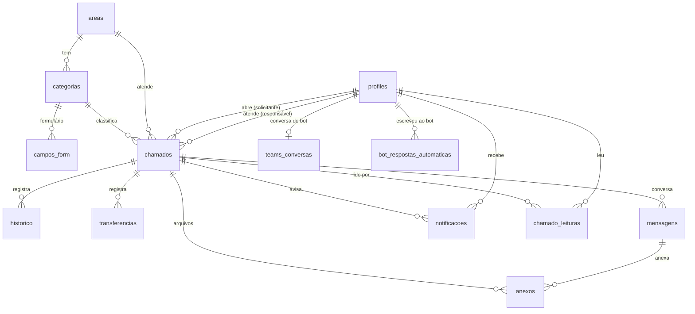

# Banco de dados

Postgres no Supabase (`sa-east-1`). Tudo é criado pelas migrations em `supabase/migrations/` (0001–0018) e testado
por `supabase/tests/database/` (pgTAP). **Nunca editar uma migration já commitada**: sempre criar uma nova.
Situação: validado a cada push no job `banco` do CI (Supabase local e descartável: migrations do zero + pgTAP + integração da API). Projetos da nuvem aguardam a assinatura (`pendencias.md` P-022).

## Desenho

## Tabelas

### Configuração
| Tabela | O que guarda | Pontos importantes |
|---|---|---|
| `configuracoes` | Parâmetros: fuso, expediente (08–18), limites de anexo, texto da resposta do bot | `publico = true` → qualquer usuário logado lê; o resto só a TI |
| `feriados` | Dias sem expediente (2026–2027 no seed: nacionais, RJ e Rio) | `ativo = false` em vez de apagar. **Cadastrar 2028 antes do fim de 2027** (P-008) |
| `areas` | Áreas que atendem (Fase 1: só TI) | — |
| `categorias` | Assuntos com prazo (`sla_horas`, em horas úteis), `nome_curto` e `icone` do portal | 13 no seed |
| `campos_form` | Campos do formulário dinâmico por categoria (texto, texto longo, número, data, seleção, múltipla, sim/não) | `chave` estável (as respostas são guardadas por ela) |

### Pessoas
| Tabela | O que guarda | Pontos importantes |
|---|---|---|
| `profiles` | Nome, e-mail, departamento, telefone, papel (`solicitante`/`ti`), `ativo` | Criado sozinho no 1º login — **ativo só se o e-mail for `@dommainc.com.br`** (`configuracoes.dominios_permitidos`, migration 0018). Inativo não lê nem faz nada. O usuário só edita departamento e telefone; o papel vem do Entra |
| `perfis_publicos` (view) | Só nome, departamento, papel e ativo de todos | Para mostrar o nome do técnico/solicitante sem expor contato |

### Chamados
| Tabela | O que guarda | Pontos importantes |
|---|---|---|
| `chamados` | Número (`id` 1, 2, 3...), título, categoria, solicitante, responsável, status, respostas do formulário, prazo, datas | Prazo calculado no banco (horas úteis + feriados). Regras: ver [status.md](status.md). **Nunca é apagado**; encerrado é só leitura |
| `historico` | Linha do tempo (criado, assumido, status, transferido, devolvido, concluído, cancelado) | Só inserção. `publico = false` → só a TI vê (ex.: motivo de transferência) |
| `transferencias` | De quem, para quem, motivo | Só inserção; só a TI lê |
| `mensagens` | Chat | Só inserção. `interna = true` → nota interna (só TI escreve e lê). Encerrado não aceita mensagem |
| `anexos` | Nome, tipo, tamanho, origem (`upload`/`colado`), caminho no Storage | Só inserção. Anexo de nota interna é invisível ao solicitante (inclusive no Storage) |
| `chamado_leituras` | Até quando cada pessoa leu a conversa | Para o selo "• Nova mensagem". Gravada só pela API |

### Avisos (Teams)
| Tabela | O que guarda | Pontos importantes |
|---|---|---|
| `notificacoes` | Fila de avisos (outbox): tipo, destinatário, payload, status `pendente`/`enviada`/`falhou`, tentativas | Gravada na mesma transação da ação; enviada depois ([ADR 0003](adr/0003-notificacoes-outbox.md)) |
| `teams_conversas` | Referência da conversa do bot com cada pessoa + último chamado avisado | Preenchida pelo bot |
| `bot_respostas_automaticas` | Log de quem escreveu ao bot | Para medir a frequência |

## Segurança (RLS)

RLS ligado em **todas** as tabelas; os acessos padrão do Supabase foram revogados (migration 0010), então
**toda tabela nova precisa de GRANT + policy explícitos + teste**.

| Tabela | Solicitante lê | TI lê | Quem grava |
|---|---|---|---|
| `chamados` | os próprios | todos | API (`central_api`) |
| `mensagens` | as não internas dos próprios chamados | todas | API |
| `anexos` | os dos próprios chamados, exceto de notas internas | todos | API |
| `historico` | os eventos públicos dos próprios chamados | todos | API |
| `transferencias`, `notificacoes`, `teams_conversas`, `bot_respostas_automaticas` | — | todos | API |
| `profiles` | o próprio | todos | o próprio (só departamento/telefone) e API |
| `chamado_leituras` | as próprias | as próprias | API |
| `configuracoes` | as públicas | todas | API |
| `categorias`, `campos_form`, `areas` | as ativas | todas | API |
| `feriados` | todos | todos | API |

Travas que valem até para quem contornar a API (triggers): encerrado não muda (`CC001`), campos imutáveis
(`CC002`), nada é apagado (`CC003`), categoria inativa (`CC004`), nota interna só da TI (`CC005`),
anexo consistente com a mensagem (`CC006`). Funções novas no schema `app` nascem sem permissão de execução
pública (migration 0015).

## Migrations

| Nº | Arquivo | Conteúdo |
|---|---|---|
| 0001 | `..._base.sql` | Schema `app`, papel `central_api`, enums |
| 0002 | `..._configuracoes_feriados.sql` | Configurações, feriados, cálculo de horas úteis |
| 0003 | `..._areas_categorias_campos.sql` | Áreas, categorias, campos do formulário |
| 0004 | `..._profiles.sql` | Perfis + criação automática no 1º login |
| 0005 | `..._chamados.sql` | Chamados + travas |
| 0006 | `..._transferencias_historico.sql` | Transferências e histórico (só inserção) |
| 0007 | `..._mensagens_anexos.sql` | Chat e anexos |
| 0008 | `..._notificacoes_teams.sql` | Outbox e tabelas do bot |
| 0009 | `..._rls_funcoes.sql` | Funções auxiliares do RLS |
| 0010 | `..._rls_policies.sql` | RLS, grants, view `perfis_publicos` |
| 0011 | `..._storage.sql` | Bucket `anexos` (privado, 10 MB, tipos permitidos) |
| 0012 | `..._indices.sql` | Índices (fila, RLS, chat, busca por título) |
| 0013 | `..._realtime.sql` | Tabelas no Realtime |
| 0014 | `..._jobs.sql` | Fechamento automático (removido na 0015) |
| 0015 | `20261005120000_status_simplificados.sql` | 6 status (ADR 0005), `concluido_em`, sem fechamento automático |
| 0016 | `20261005150000_categorias_icone_nome_curto.sql` | Ícone e nome curto das categorias |
| 0017 | `20261005180000_chamado_leituras.sql` | Leitura da conversa (selo "Nova mensagem") |
| 0018 | `20261007090000_dominio_e_inativos.sql` | Só `@dommainc.com.br` fica ativo; solicitante inativo não lê mais nada (P-005, P-009) |
