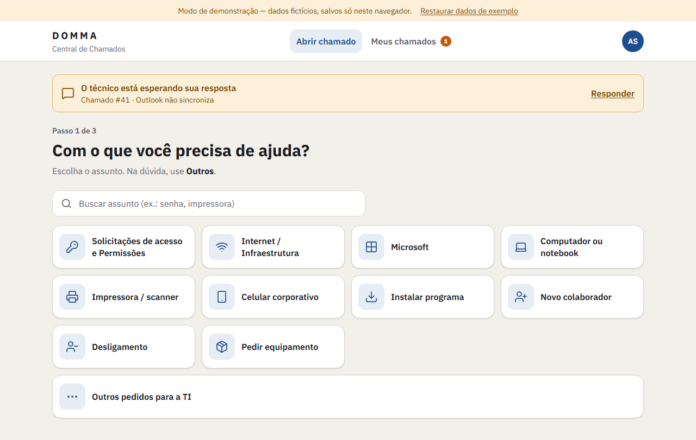
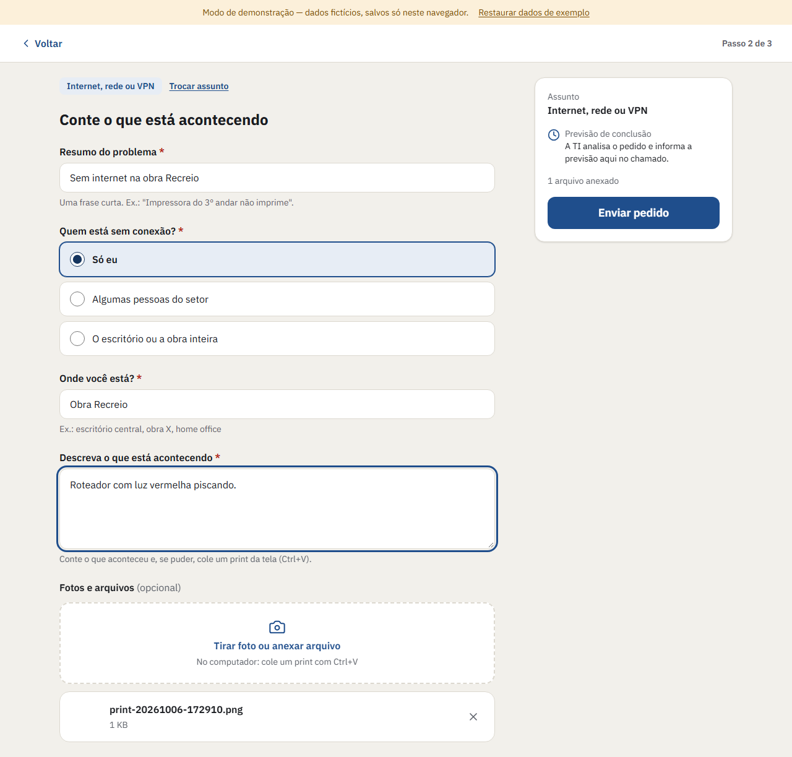
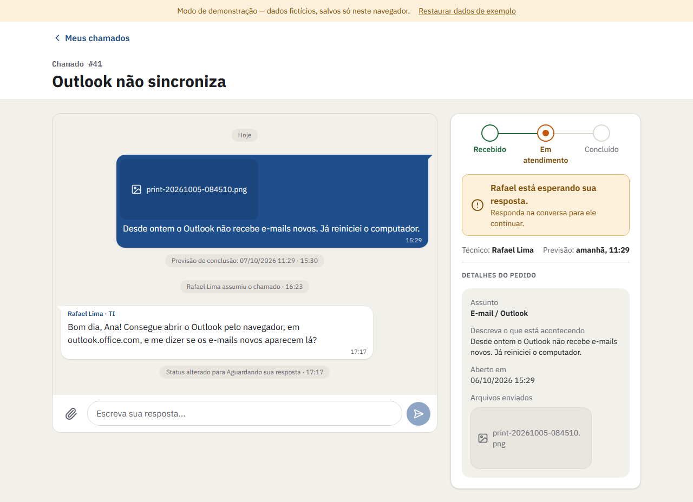
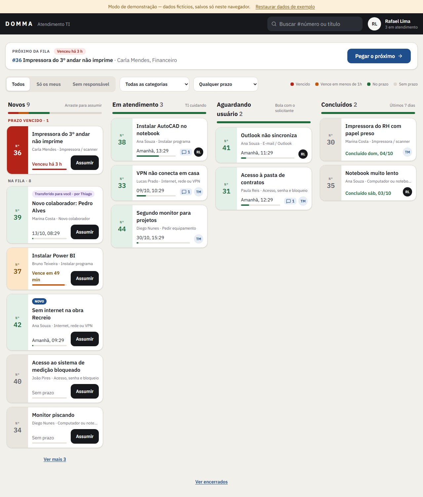
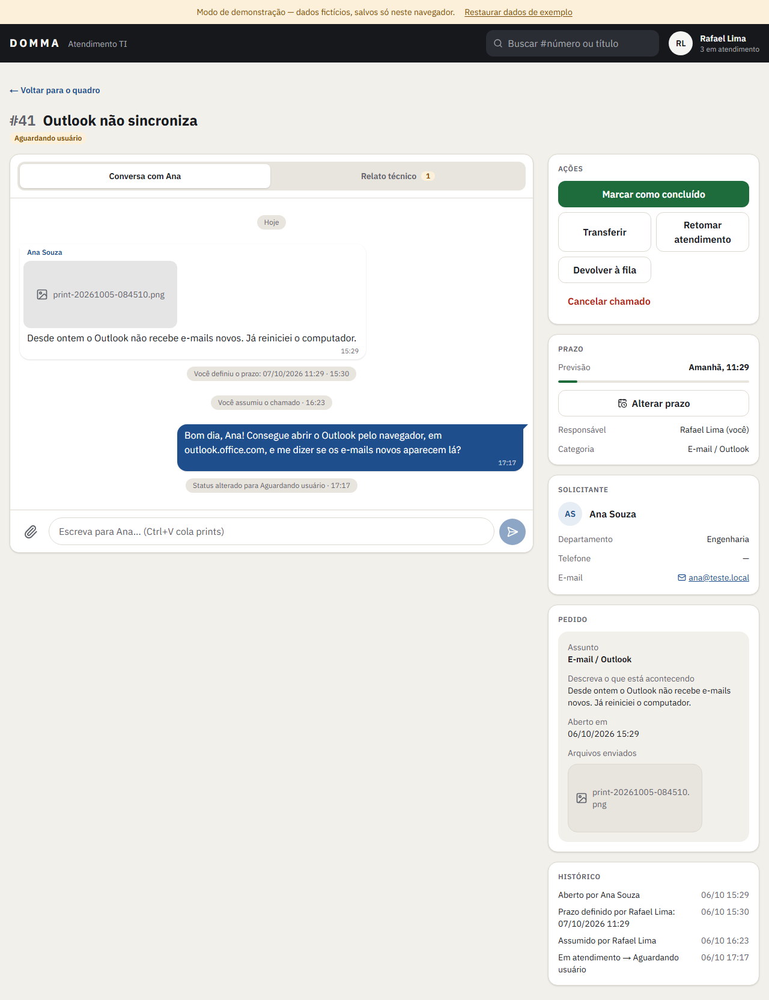
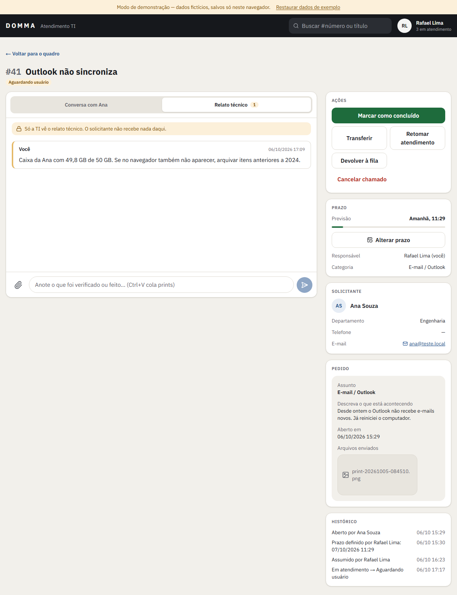

# Central de Chamados — guia rápido

A Central é o lugar para pedir ajuda à TI e acompanhar o seu pedido até o fim.
Você entra com a sua **conta Microsoft** (a mesma do Outlook e do Teams).

> As imagens abaixo são do modo de demonstração, com dados fictícios.

---

## Para quem pede ajuda

### 1. Abrir um pedido (3 passos)

**Passo 1 — Escolha o assunto.** Toque no cartão que mais combina com o seu problema.
Não achou? Use a busca ou escolha **Outros pedidos para a TI**.

**Passo 2 — Conte o que está acontecendo.** Escreva um resumo curto e responda às perguntas.
Os campos com * são obrigatórios.

- **Mande um print:** aperte **Win + Shift + S**, recorte a tela e depois **Ctrl + V** no formulário.
  No celular, toque em **Tirar foto ou anexar arquivo**.
- Arquivos aceitos: imagens, PDF e documentos do Office, até **10 MB** cada.

**Passo 3 — Pronto!** Você recebe o **número do chamado** (ex.: **#42**). A **previsão de conclusão** quem
informa é a TI, depois de analisar o pedido: ela aparece no chamado e você recebe um aviso.
Você também vai receber avisos no **Teams** quando o técnico assumir ou responder.

### 2. Acompanhar e conversar

Em **Meus chamados** você vê tudo o que abriu. O selo **• Nova mensagem** mostra que a TI respondeu.

Ao abrir um chamado, a conversa com o técnico fica no centro. Escreva no campo de baixo e toque
em enviar. Se aparecer **"Aguardando sua resposta"**, o técnico precisa de você para continuar —
assim que você responder, o atendimento volta a andar.

- **Sem internet?** Aparece um aviso. Sua mensagem não se perde: toque nela para enviar de novo.
- **Mudou de ideia?** Enquanto o chamado estiver **Recebido** (antes de um técnico assumir), use
  **Cancelar chamado** e diga o motivo. Depois disso, peça o cancelamento pela conversa.
- **Concluído e o problema voltou?** Toque em **Abrir novo pedido** — ele já vem com o número do anterior.

---

## Para a equipe de TI

### O quadro

Ao entrar, você vê o **quadro** com quatro colunas lado a lado: **Novos**, **Em atendimento**, **Aguardando usuário**
e **Concluídos** (os dos últimos 7 dias). Em tela menor, deslize para o lado ou use os botões das colunas.

- **Pegar o próximo:** assume o chamado mais urgente da fila e abre direto nele.
- **Assumir:** botão em cada cartão novo. Você também pode **arrastar** o cartão para outra coluna —
  arrastar para **Concluídos** conclui o chamado (pede confirmação).
- **Cores do prazo:** vermelho = vencido · laranja = vence em menos de 1 hora · verde = no prazo · cinza = sem prazo.
- **O prazo é você quem define:** na tela do chamado, cartão **Prazo** → **Definir prazo** (data e hora, com atalhos).
  Para mudar depois, **Alterar prazo** pede o motivo. O solicitante vê a previsão e o motivo.
- **Filtros:** Todos / Só os meus / Sem responsável, categoria e prazo. O link da página guarda os filtros.
- **Busca:** digite o número (ex.: `42`) para abrir o chamado direto, ou parte do título.
- **Busca por texto** (ex.: `impressora`) deixa no quadro só os chamados com essa palavra no título.
- Os chamados concluídos e cancelados ficam em **Ver encerrados**, no fim do quadro.

### Atendendo um chamado

- A aba **Conversa com …** é só para falar com o solicitante: tudo o que você escreve ali, ele recebe.
- A aba **Relato técnico** é o diário da TI (**o solicitante não vê**): anote o que foi verificado e o que foi
  feito, cole prints com Ctrl+V. As transferências e devoluções à fila aparecem ali com o motivo. As anotações
  não podem ser editadas nem apagadas.

- **Ações** mostra só o que dá para fazer agora:
  - **Marcar como concluído** — encerra o chamado (mesmo se o solicitante não respondeu);
  - **Aguardar usuário / Retomar atendimento** — quando você precisa de uma resposta;
  - **Transferir** — para outro técnico, com motivo (ele precisa assumir);
  - **Devolver à fila** — volta para Novos, sem responsável, com motivo;
  - **Cancelar chamado** — com motivo.
- Ao lado ficam o **prazo**, o **contato do solicitante**, o **pedido** com os arquivos e o **histórico**
  completo (inclusive transferências e o motivo de cada uma).

---

Dúvidas ou sugestões sobre a Central? Abra um chamado em **Outros pedidos para a TI**. 🙂
