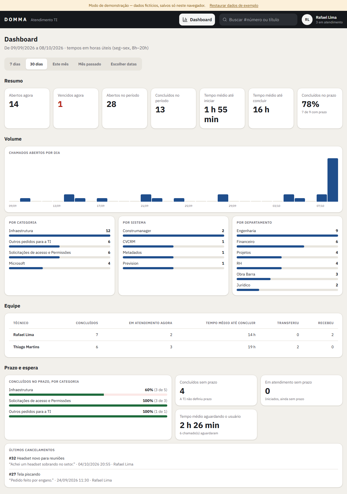

# Central de Chamados — guia rápido

A Central é o lugar para pedir ajuda à TI e acompanhar o seu pedido até o fim.
Você entra com a sua **conta Microsoft** (a mesma do Outlook e do Teams).

> As imagens abaixo são do modo de demonstração, com dados fictícios.

---

## Para quem pede ajuda

### 1. Abrir um pedido (3 passos)

**Passo 1 — Escolha o assunto.** Toque no cartão que mais combina com o seu problema.
Não achou? Use a busca ou escolha **Outros pedidos para a TI**.

**Passo 2 — Conte o que está acontecendo.** Escreva um resumo curto e responda às perguntas.
Os campos com * são obrigatórios.

- **Mande um print:** aperte **Win + Shift + S**, recorte a tela e depois **Ctrl + V** no formulário.
  No celular, toque em **Tirar foto ou anexar arquivo**.
- Arquivos aceitos: imagens, PDF e documentos do Office, até **10 MB** cada.

**Passo 3 — Pronto!** Você recebe o **número do chamado** (ex.: **#42**). A **previsão de conclusão** quem
informa é a TI, depois de analisar o pedido: ela aparece no chamado e você recebe um aviso.
Você também vai receber avisos no **Teams** quando o técnico iniciar o atendimento ou responder.

### 2. Acompanhar e conversar

Em **Meus chamados** você vê tudo o que abriu. O selo **• Nova mensagem** mostra que a TI respondeu.

Ao abrir um chamado, a conversa com o técnico fica no centro. Escreva no campo de baixo e toque
em enviar. Se aparecer **"Aguardando sua resposta"**, o técnico precisa de você para continuar —
assim que você responder, o atendimento volta a andar.

- **Sem internet?** Aparece um aviso. Sua mensagem não se perde: toque nela para enviar de novo.
- **Mudou de ideia ou o problema se resolveu?** Avise pela conversa — quem cancela o chamado é a TI.
- **Respondeu e a TI pediu algo?** Se você ficar 2 horas (de expediente) sem responder, o chamado fica como
  **Aguardando sua resposta**; depois de 24 horas, a Central manda um lembrete no chat. É só responder que o
  atendimento continua.
- **Concluído e o problema voltou?** Toque em **Abrir novo chamado** — ele já vem com o número do anterior.

---

## Para a equipe de TI

### O quadro

Ao entrar, você vê o **quadro** com seis colunas lado a lado: **Novos**, **Em atendimento**, **Aguardando usuário**,
**Concluídos**, **Transferidos** e **Cancelados** (concluídos e cancelados: só os dos últimos 7 dias). Em tela menor,
deslize para o lado ou use os botões das colunas. A **faixa colorida do cartão** é a do **status** (laranja = novo,
amarelo = em atendimento, azul = aguardando o usuário, verde = concluído, roxo = transferido, cinza = cancelado).

- **Iniciar:** abra o chamado e clique em **Iniciar**, ou **arraste** o cartão de Novos para Em atendimento. Você também
  pode **arrastar** o cartão para outra coluna
  (no celular: **segure o cartão** um instante e arraste; na borda da tela, ela rola sozinha) —
  arrastar para **Concluídos** conclui o chamado (pede confirmação) e para **Cancelados** cancela (pede o motivo).
- **Aguardando usuário** é automático: o chamado vai sozinho para lá depois de **2 horas úteis** sem resposta do
  solicitante e volta para Em atendimento quando ele responder.
- **Prioridade** no topo do cartão: Alta (vermelho, sobe para o topo da coluna) · Média (amarelo) · Baixa (cinza).
  Em Em atendimento, a bolinha mostra as iniciais de quem está atendendo.
- **Prazo** no retângulo do cartão: vermelho = vencido · laranja = vence em menos de 1 hora · amarelo = sem prazo
  definido · branco = em dia. O 💬 com número mostra mensagens novas.
- **Filtros:** Status (mostra só aquela coluna), Pessoa atendendo (você, ninguém ainda ou um técnico), categoria e
  prazo. O link da página guarda os filtros.
- **Transferidos:** os chamados passados de um técnico para outro ficam nesta coluna até o técnico de destino clicar
  em **Iniciar**. Arraste para cá para transferir (pede o técnico e o motivo).
- **O prazo é você quem define:** na tela do chamado, bloco **Prazo** no topo → **Definir prazo** (data e hora, com atalhos).
  Para mudar depois, **Alterar prazo** pede o motivo. O solicitante vê a previsão e o motivo.
- **Busca:** digite o número (ex.: `42`) para abrir o chamado direto, ou parte do título.
- **Busca por texto** (ex.: `impressora`) deixa no quadro só os chamados com essa palavra no título.
- Os chamados concluídos e cancelados ficam em **Ver encerrados**, no fim do quadro.

### Atendendo um chamado

- **Antes de clicar em Iniciar**, você pode abrir o chamado e ver tudo, mas não pode conversar, anotar, definir prazo
  nem prioridade — só **Iniciar** ou **Cancelar** (ex.: chamado duplicado).
- A aba **Conversa com …** é só para falar com o solicitante: tudo o que você escreve ali, ele recebe.
- **Prioridade** (no topo do chamado): **Alta** · **Média** · **Baixa**. Só a TI vê. A alta sobe para o topo da coluna
  no quadro, com o aviso vermelho **⚠ Prioridade alta**.
- Depois que você responde, se o solicitante ficar **2 horas úteis** sem responder, o chamado vai sozinho para
  **Aguardando usuário**; com **24 horas úteis**, a Central manda um lembrete automático para ele. Quem conclui é você.
- A aba **Relato técnico** é o diário da TI (**o solicitante não vê**): anote o que foi verificado e o que foi
  feito, cole prints com Ctrl+V. As transferências aparecem ali com o motivo. As anotações
  não podem ser editadas nem apagadas.

- No **topo** ficam o solicitante (com e-mail e o botão **"Falar no Teams"**), o responsável, o prazo e a categoria, e as **ações** —
  só as que dá para fazer agora:
  - **Marcar como concluído** — encerra o chamado (mesmo se o solicitante não respondeu);
  - **Transferir** — para outro técnico, com motivo (ele precisa iniciar);
  - **Cancelar chamado** — com motivo.
- Ao lado da conversa ficam as respostas do **pedido** e o **histórico** completo (clique para abrir),
  inclusive transferências e o motivo de cada uma.

### Dashboard

- Botão **Dashboard** no topo, ao lado da busca. Mostra os números da equipe no período escolhido
  (7 dias, 30 dias, este mês, mês passado ou datas à sua escolha).
- **Resumo**: quantos chamados estão abertos e vencidos agora, quantos entraram e saíram no período, os tempos
  médios até iniciar e até concluir e quantos foram concluídos dentro do prazo.
- **Volume**: chamados por dia e os assuntos, sistemas e departamentos que mais pedem ajuda.
- **Equipe**: o que cada técnico concluiu, quantos tem em atendimento e as transferências.
- **Prazo e espera**: prazo cumprido por categoria, chamados sem prazo, quanto tempo esperamos os usuários e os
  últimos cancelamentos.
- Todos os tempos contam **horas úteis** (seg–sex, 8h–18h, sem feriados).

---

Dúvidas ou sugestões sobre a Central? Abra um chamado em **Outros pedidos para a TI**. 🙂
