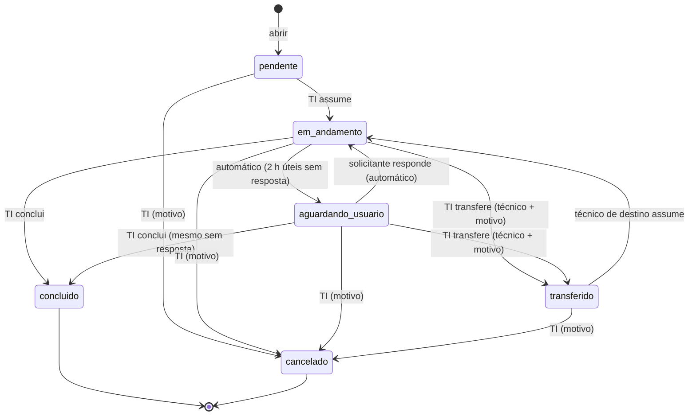

# Ciclo de vida do chamado

Seis status ([ADR 0005](adr/0005-status-simplificados.md)). A tabela de transições oficial é a do
[CLAUDE.md](../CLAUDE.md); o código que a aplica é `apps/api/app/dominio/estados.py` (espelho no front:
`apps/web/lib/dominio/estados.ts`, usado no modo simulado e para mostrar só os botões permitidos).

## Nomes na tela

| Status | Solicitante vê | TI vê | Coluna do kanban |
|---|---|---|---|
| `pendente` | Recebido | Novo | Novos |
| `em_andamento` | Em atendimento | Em atendimento | Em atendimento |
| `aguardando_usuario` | **Aguardando sua resposta** | Aguardando usuário | Aguardando usuário |
| `transferido` | Em atendimento | Transferido | Novos (selo "Transferido para você") |
| `concluido` | Concluído | Concluído | Concluídos (últimos 7 dias) |
| `cancelado` | Cancelado | Cancelado | — ("Ver encerrados") |

## Regras que valem sempre
- **Concluído e cancelado são finais**: somente leitura, sem reabertura. Se o problema voltar, o solicitante abre
  um novo pedido (a tela oferece "Abrir novo pedido" já citando o número anterior).
- **Sem fechamento automático** e sem confirmação do solicitante.
- **Só a TI cancela** ([ADR 0011](adr/0011-regras-de-atendimento-e-automacoes.md)); o solicitante recebe `CANCELAMENTO_NAO_PERMITIDO`.
- **Sem aguardar, retomar e devolver à fila** ([ADR 0014](adr/0014-sem-aguardar-retomar-e-devolver.md)):
  aguardando usuário é só automático. Transferido só é iniciado pelo técnico de destino; os outros só cancelam.
- **Toda transição grava histórico + notificação pendente** na mesma transação.
- Regras no banco (valem até se a API falhar): `pendente` sem responsável; `em_andamento`, `aguardando_usuario`
  e `transferido` exigem responsável; `concluido` exige data; `cancelado` exige motivo; encerrado não muda (`CC001`).
